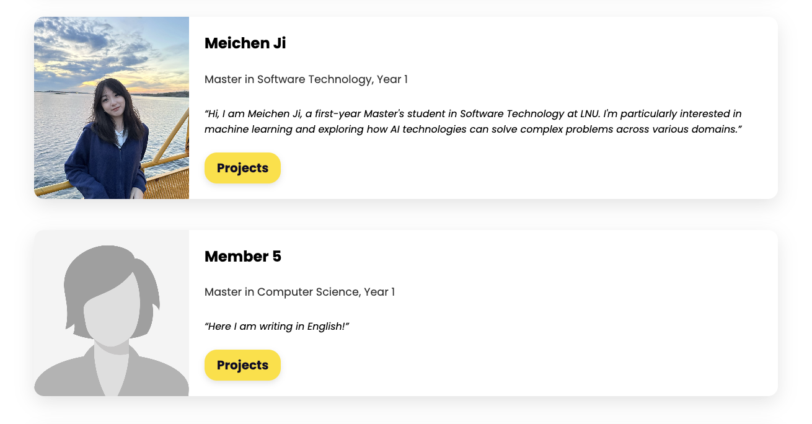

# tep-website-data
This repo is served as database for member and project info for TEP members.


## TEP member Instructions

As a team member, you can edit your profile directly:

1. Navigate to the data file (`data/members.json`).
2. Click the pencil icon to edit the json, you can editing existing entry or add a new entry, and the id should be incremented.
3. Upload your photo to `assets/members_pic/` and add the path `./assets/members_pic/your-name.png"` to your json entry. The photo should be a square image.
4. The project field, if any, should be an array of project ids from `data/projects.json`.
5. Commit directly to the main branch.

Example entry:
```json
{
    "id": 1,
    "name": "Meichen Ji",
    "photo": "./assets/members_pic/meichen-ji.png",
    "programName": "Software Technology",
    "degreeLevel": "Master",
    "yearOfStudy": "1",
    "description": "Hi, I am Meichen Ji, a first-year Master's student in Software Technology at LNU. I'm particularly interested in machine learning and exploring how AI technologies can solve complex problems across various domains.",
    "projects": [1, 2]
  },
```

What it looks like on the website:



## TEP project Instructions
As a team member, you can edit your project directly:
1. Navigate to the data file (`data/projects.json`).
2. Click the pencil icon to edit the json, you can you can editing existing entry or add a new entry, and the id should be incremented.
3. Upload your project image to `assets/projects_pic/` and add the path `./assets/projects_pic/your-project.png"` to your json entry. The image should be a horizontal rectangle.
4. Commit directly to the main branch.

Example entry:
```json
{
    "id": 2,
    "title": "TEP Website Development",
    "date": "2025-09-19",
    "description": "Developing and maintaining the TEP website to ensure it is user-friendly, up-to-date, and informative for current and prospective members.",
    "category": "Development",
    "image": "./assets/projects_pic/web-development.jpg"
  },
```

What it looks like on the website:


## TODO
- [ ] Make the info automatically update on the website, currently it needs to be manually deployed.
- [ ] Add more fields to member and project info, e.g., social media links, project links, etc.
